<div align="center">
  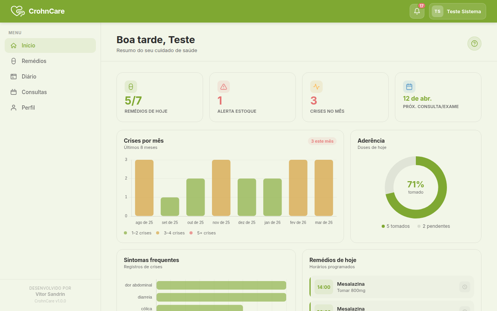

  <h1>CrohnCare</h1>
  <p><strong>Seu companheiro no cuidado com a saúde intestinal</strong></p>
  <p>Aplicativo web e mobile para pacientes com Doença de Crohn e Retocolite Ulcerativa gerenciarem seu tratamento, registrarem sintomas e acompanharem sua saúde ao longo do tempo.</p>

  
  
  
</div>

---

## Funcionalidades

- **Início** — Painel com resumo diário: remédios, crises, próxima consulta, aderência e gráficos
- **Remédios** — Cadastro de medicamentos com horários, dosagem e controle de estoque
- **Diário de Saúde** — Anotações diárias com indicador de bem-estar e registro de crises
- **Consultas e Exames** — Agenda médica com histórico de atendimentos
- **Avisos** — Notificações de lembretes de remédios e alertas de estoque baixo
- **Perfil** — Configurações da conta, tema e informações de saúde
- **Tour interativo** — Guia pelas principais funcionalidades ao primeiro acesso
- **Notificações push** — Lembretes de medicamentos via FCM
- **Tema personalizável** — Verde, azul, âmbar ou rosa

---

## Telas — Desktop

| Início | Remédios |
|--------|----------|
|  | 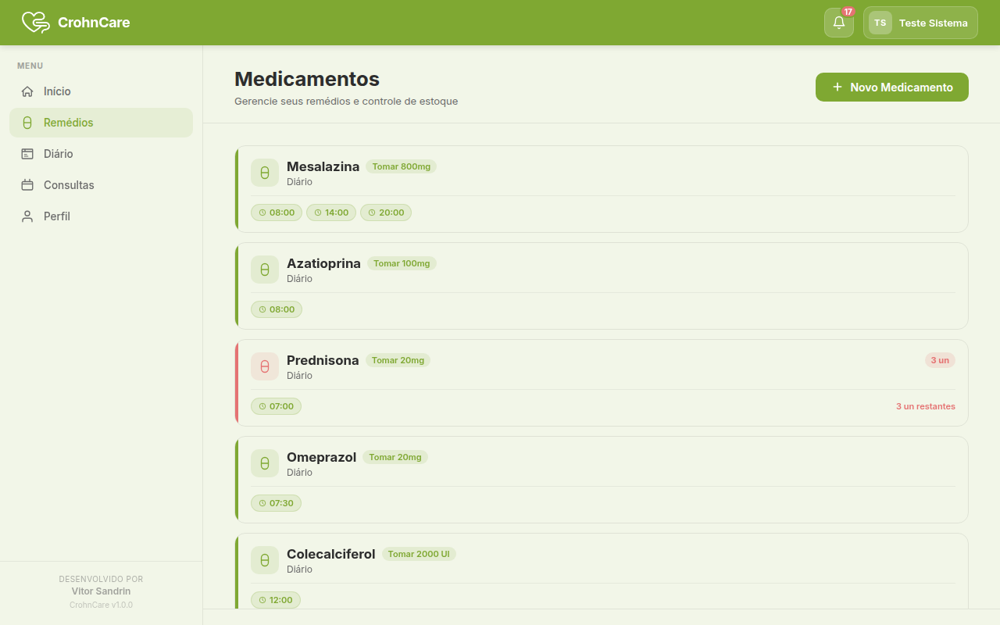 |

| Diário de Saúde | Consultas e Exames |
|-----------------|-------------------|
| 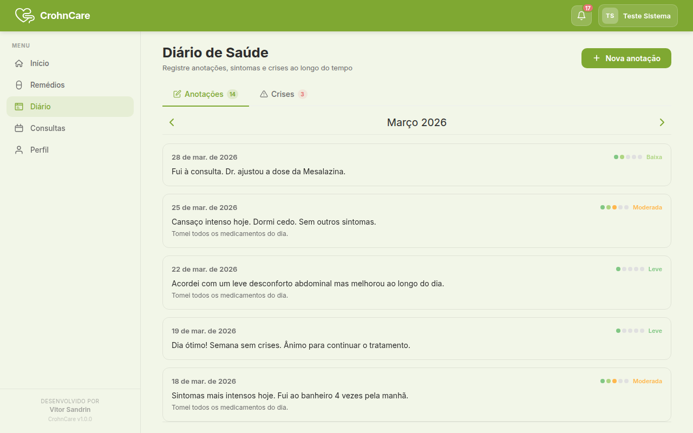 | 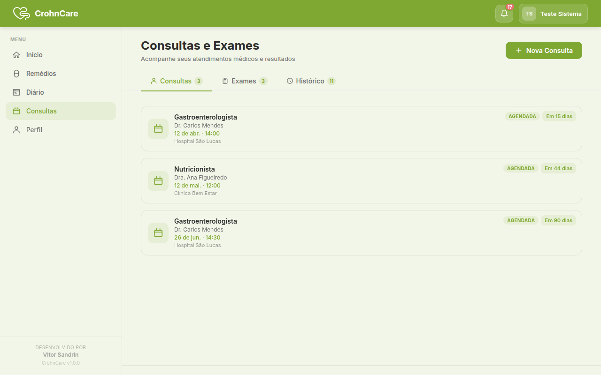 |

| Avisos | Perfil |
|--------|--------|
| 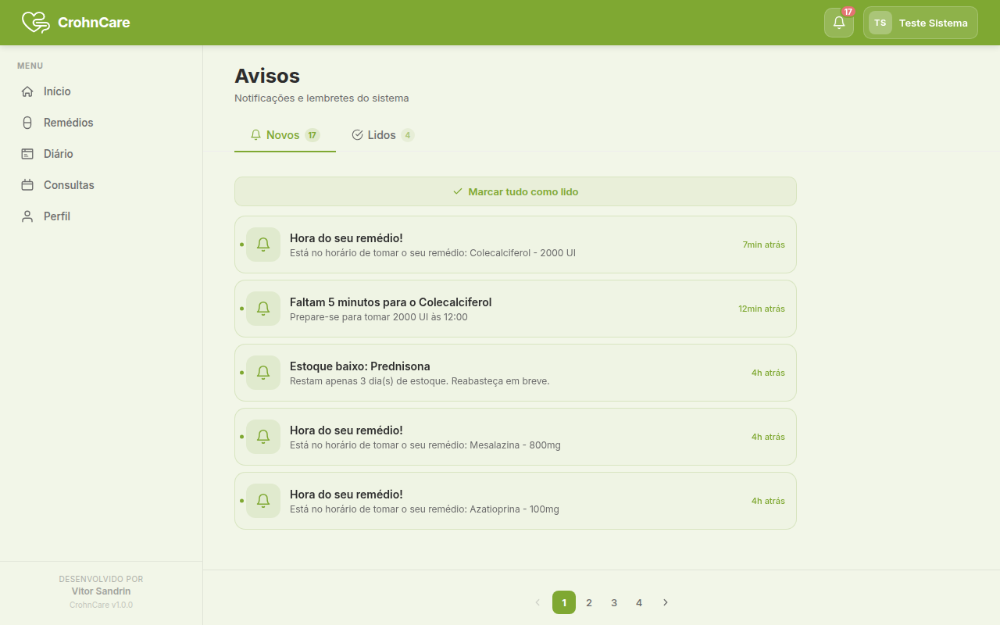 | 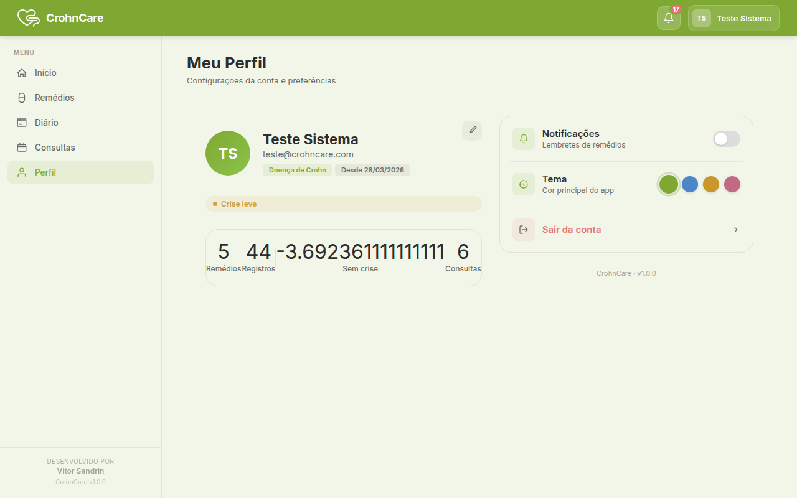 |

---

## Telas — Mobile

<div align="center">

| Início | Remédios | Diário |
|--------|----------|--------|
| 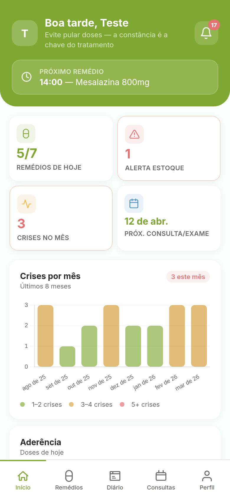 | 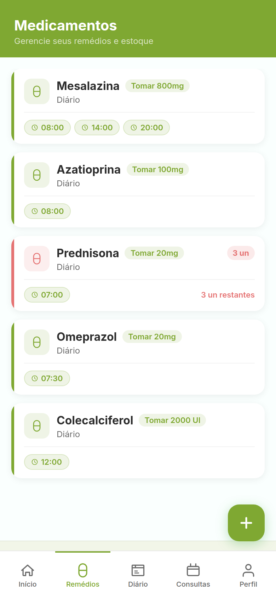 | 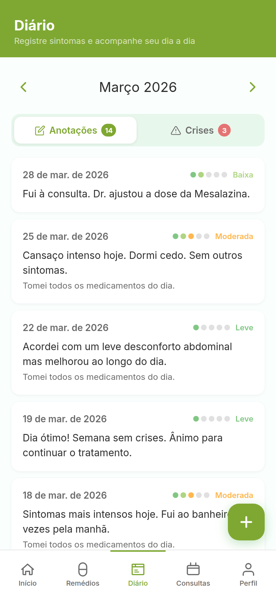 |

| Consultas | Avisos | Perfil |
|-----------|--------|--------|
| 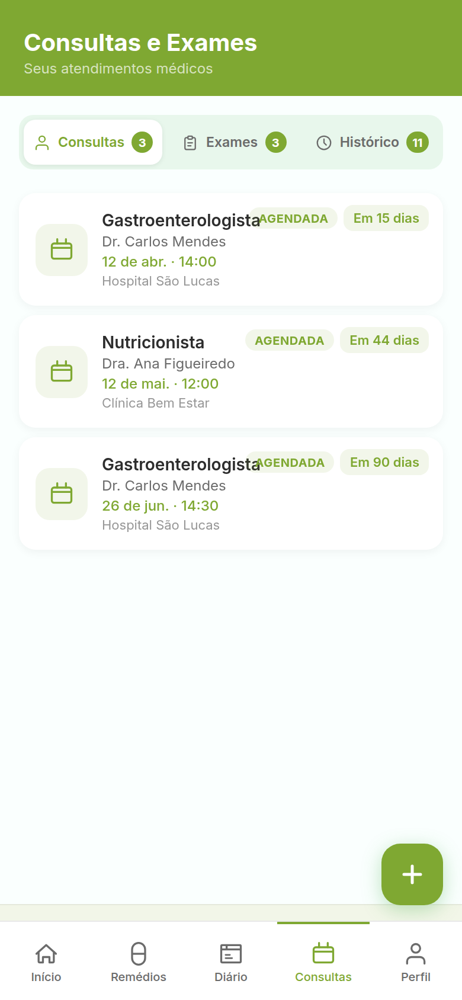 | 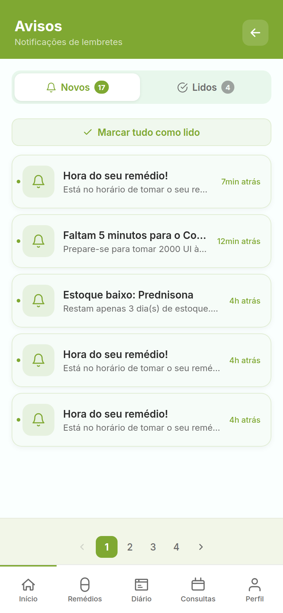 | 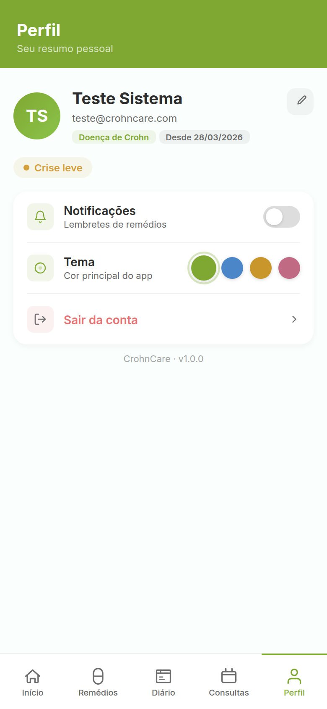 |

</div>

---

## Stack

| Camada | Tecnologia |
|--------|-----------|
| Frontend | Vue 3 + Vite + Pinia |
| Backend | Laravel 10 + MySQL |
| Notificações | Firebase Cloud Messaging (FCM) |
| Deploy | VPS com GitHub Actions CI/CD |
| URL | [crohncare.online](https://crohncare.online) |

---

## Executar localmente

```bash
# Backend
cd backend
cp .env.example .env
composer install
php artisan key:generate
php artisan migrate --seed
php artisan serve

# Frontend
cd frontend
npm install
npm run dev
```

---

## Deploy

O deploy é automático via GitHub Actions a cada push na branch `main`. O workflow conecta ao VPS via SSH e executa o script de build e restart.

---

<div align="center">
  <sub>Desenvolvido por <strong>Vitor Sandrin</strong></sub>
</div>
